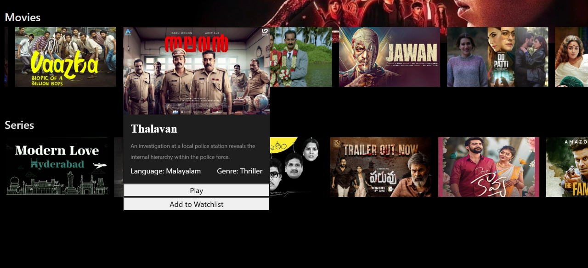

# Full‑stack‑frontend 🔧

A modern full‑stack web application built with React for the frontend. This project demonstrates a responsive UI with proper asset management, routing, and API integration.

## 🧭 Table of Contents

- [Overview](#overview)  
- [Demo](#demo)  
- [Features](#features)  
- [Tech Stack](#tech-stack)  
- [Screenshots](#screenshots)  
- [Setup & Installation](#setup--installation)  
- [License](#license)

---

## Overview

This project showcases a responsive frontend built using React. It includes proper routing, component structure, and asset management, with images stored in the `src/assets` folder.

## Demo

*(Add a deployment link here if available)*

---

## Features

- React component-based architecture  
- Responsive design  
- React Router for navigation  
- API integration (if applicable)  
- Asset management with images in `src/assets`

---

## Tech Stack

- **Frontend:** React, JavaScript, React Router, CSS 
- **State Management:** React Context  
- **Build Tool:** Create React App 

---

## Screenshots

| Home Page | Detail Page | Detail Page | Detail Page | Detail Page | Detail Page | Detail Page |
|:---------:|:-----------:|:-----------:|:-----------:|:-----------:|:-----------:|:-----------:|
|  |  | | | | | |

---

## Setup & Installation

1. **Clone the repository:**
   ```bash
   git clone https://github.com/nikhil9345/Full-stack-frontend.git
   cd Full-stack-frontend
  ## Frontend to start
   npm run dev
   Open http://localhost:3000 to view the app.
  ## Backend to start
  npx json-server db.json


---

If you want, I can help you:
- Add badges (build, license, etc.)
- Generate a table of contents automatically  
- Write API documentation (if you add backend)

Let me know!
